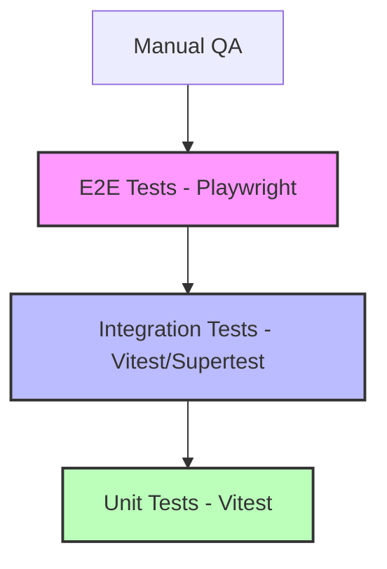

# Test Strategy - FISH_MARKET Production Grade

## 🛠️ The Testing Pyramid

### 1. Unit Tests (80% Coverage Target)
- **Focus**: Pure functions, NLP parsing, ₹ currency formatters, Tamil character normalization.
- **Tooling**: Vitest.
- **When**: Every commit.

### 2. Integration Tests
- **Focus**: API Endpoints (Supertest), Database constraints, Sync logic (IDB to MySQL).
- **Tooling**: Vitest, Supertest, Pact.js (Contract Testing).
- **Data Management**: Use `seed.test.ts` for isolated state.

### 3. E2E & Visual Regression
- **Focus**: Critical user journeys (Login -> Voice Entry -> Settlement).
- **Tooling**: Playwright, axe-core (Accessibility), Percy/Chromatic (Visual).
- **Devices**: Emulate Pixel 5 and iPhone 12 viewports.

## 📉 Risk Matrix

| Feature | Impact | Likelihood | Mitigation |
| :--- | :--- | :--- | :--- |
| **Voice Entry** | Critical | High | Extensive negative testing with background noise/Tamil accents. |
| **Offline Sync** | Critical | Medium | Conflict resolution tests & network speed throttling. |
| **Financials (₹)** | High | Low | Precision tests (0.0001 delta) & immutable transaction logs. |
| **Migrations** | Medium | Low | Rollback verification tests in CI/CD. |

## 🔁 Rollback & Recovery Plan

1. **DB Rollback Verification**: Every migration must be accompanied by a `down` script. CI/CD runs `up` then `down` to ensure reversibility.
2. **Feature Flags**: Critical changes (e.g., new NLP engine) must be behind flags for instant toggle-off.
3. **PWA Refresh**: Service Worker versioning must allow forceful cache purging if a corrupt build is deployed.

## 📊 Coverage & Quality Gates

- **Unit/Integ**: >80% code coverage.
- **Security**: 0 P0/P1 vulnerabilities (OWASP Top 10).
- **Performance**: <200ms API response (P95), <2s TTI on 3G.
- **Accessibility**: WCAG 2.1 AA compliant.
