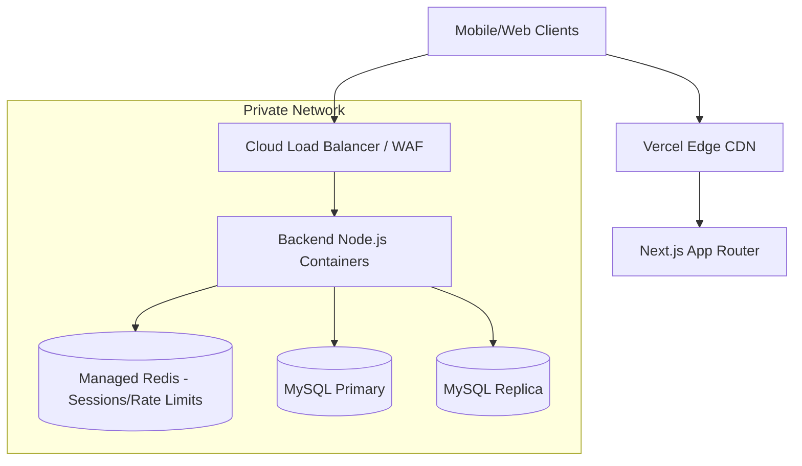

# Phase 9 — Production Deployment & Operational Readiness

This playbook defines the exact architecture, infrastructure, and operational workflows required to take the Fish Market platform from "Code Complete" to "Highly Available Production Platform."

---

## 1. Production Architecture Topology

The production architecture abandons legacy PM2/VPS deployments in favor of a containerized, auto-scaling, and highly available topology.

*   **Frontend (Next.js)**: Deployed to **Vercel** (or AWS Amplify/GCP Cloud Run) to leverage global edge CDNs, serverless SSR, and automatic image optimization.
*   **Backend (Express.js/Workers)**: Deployed as stateless Docker containers via **Google Cloud Run** or **AWS ECS Fargate**. Auto-scales from 2 to 50 instances based on CPU and request concurrency.
*   **Database (MySQL)**: Managed **Cloud SQL (GCP) or RDS (AWS)**. Configured with a Primary + Read Replica for analytics/reporting offload.
*   **Cache & Sessions (Redis)**: Managed **Memorystore (GCP) or ElastiCache (AWS)**. Deployed in a private subnet, handling session denylists, rate limiting, and temporary offline sync data.

---

## 2. Infrastructure Blueprint



**Networking Constraints**:
*   The Database and Redis clusters **DO NOT** have public IP addresses.
*   Backend containers communicate with DB/Redis via private VPC peering.
*   WAF (Web Application Firewall) protects the API load balancer from volumetric DDoS and SQLi attacks.

---

## 3. Docker Optimization Plan

The current Dockerfiles naively run `npm install` across the monorepo. We must optimize them using Turborepo's `turbo prune` to drastically reduce build times and image sizes.

**Hardened Backend Dockerfile:**
```dockerfile
# Stage 1: Prune
FROM node:20-alpine AS pruner
WORKDIR /app
RUN npm install -g turbo
COPY . .
RUN turbo prune --scope=backend --docker

# Stage 2: Install
FROM node:20-alpine AS installer
WORKDIR /app
COPY .gitignore .gitignore
COPY --from=pruner /app/out/json/ .
COPY --from=pruner /app/out/package-lock.json ./package-lock.json
RUN npm ci

# Stage 3: Build
FROM node:20-alpine AS builder
WORKDIR /app
COPY --from=installer /app/ .
COPY --from=pruner /app/out/full/ .
RUN npx turbo run build --filter=backend...

# Stage 4: Production Runner
FROM node:20-alpine AS runner
WORKDIR /app
# Only copy necessary runtime files
COPY --from=builder /app/apps/backend/dist ./dist
COPY --from=builder /app/apps/backend/package.json ./package.json
COPY --from=installer /app/node_modules ./node_modules

# Security Hardening
USER node
ENV NODE_ENV=production
EXPOSE 5000
CMD ["node", "dist/index.js"]
```

---

## 4. CI/CD Hardening

The existing `.github/workflows/deploy.yml` references outdated `client/` and `server/` directories and deploys via PM2 over SSH. This must be upgraded to a GitOps model:

1.  **Monorepo Path Fix**: Update all workflow triggers and working directories to `apps/frontend` and `apps/backend`.
2.  **Remove PM2 SSH Deploy**: Replace the `appleboy/ssh-action` with Docker Build & Push actions (e.g., to Google Artifact Registry or AWS ECR).
3.  **Deployment Pre-flight**: Add an integration testing step `npm run test:e2e` that runs against a temporary Postgres/Redis Docker compose stack before *any* deployment.
4.  **Preview Environments**: Vercel handles frontend previews natively. For backend previews, deploy branched containers to Cloud Run behind a temporary hash URL.

---

## 5. Database Operations (MySQL)

*   **Automated Backups**: Enable automated daily snapshots with a 7-day retention policy.
*   **Point-in-Time Recovery (PITR)**: Enable PITR utilizing write-ahead logs (WAL). This allows recovery to any exact minute in the last 7 days in case of accidental data wiping.
*   **Migration Safety**: Never run `ALTER TABLE ... DROP COLUMN` directly. Add the new column, sync data, deploy the new code, then drop the old column in a subsequent release.

---

## 6. Redis Production Design

*   **Eviction Policy**: `volatile-lru`. We only want Redis to evict keys with a TTL (like rate limit counters). JWT Denylists must **never** be evicted before their natural expiry.
*   **Memory Limit**: 1GB minimum. Alert if memory crosses 80%.
*   **Persistence**: Turn ON `AOF` (Append Only File) with `fsync=everysec`. This ensures rate limiting and auth states survive a Redis node reboot.

---

## 7. Monitoring & Alerting

Deploy structured dashboards (Datadog, New Relic, or GCP Monitoring) focused on the Golden Signals:

| Metric | Warning Threshold | Critical Threshold | Escalation |
| :--- | :--- | :--- | :--- |
| API Error Rate (5xx) | > 1% over 5m | > 5% over 5m | PagerDuty (On-call) |
| API P95 Latency | > 500ms | > 1000ms | Slack Alert |
| NLP Worker Fallbacks | > 5/min | > 20/min | Slack Alert |
| Node.js CPU | > 70% | > 90% | Auto-scale triggers |
| Database Connections | > 70% capacity | > 90% capacity | PagerDuty (On-call) |

---

## 8. Security Hardening Checklist

- [ ] **Secret Management**: Move all secrets from `.env` files into AWS Secrets Manager or GCP Secret Manager. Inject at runtime.
- [ ] **Network Isolation**: Ensure the `DATABASE_URL` is an internal VPC IP, entirely inaccessible from the public internet.
- [ ] **CORS Strictness**: The backend `ALLOWED_ORIGINS` must exactly match the production Vercel domains. No wildcards (`*`).
- [ ] **Helmet & CSP**: Ensure Express uses `helmet()` to enforce HSTS (Strict-Transport-Security) and block MIME sniffing.
- [ ] **Rate Limit Persistence**: Ensure distributed rate limiters (`rateLimiter.ts`) fallback gracefully to memory if Redis blips, rather than crashing the request.

---

## 9. Release Engineering Workflow

1.  **Branching**: `main` is production. Feature branches merge into `main` via PR.
2.  **Tagging**: Trigger production releases by cutting a GitHub Release with SemVer (e.g., `v1.2.0`). This prevents accidental pushes to `main` from deploying immediately.
3.  **Migration Execution**: The CI pipeline must run database migrations (`npm run db:migrate`) *before* swapping the container traffic to the new image.

---

## 10. Rollback Procedures

If a deployment fails or critical bugs are detected:
1.  **Frontend Rollback**: One-click "Instant Rollback" in the Vercel Dashboard to the previous successful deployment.
2.  **Backend Rollback**: Re-deploy the previously tagged Docker image via the Cloud Provider console or GitHub Action.
3.  **Database Rollback**: Migrations are strictly *additive*. Avoid down-migrations (`.down.sql`) in production as they destroy data. Instead, roll-forward with a fix.

---

## 11. Disaster Recovery Plan

**Scenario: Complete Region Outage**
*   **RTO (Recovery Time Objective)**: 4 Hours.
*   **RPO (Recovery Point Objective)**: 1 Hour (based on DB replication/snapshot frequency).
*   **Strategy**: Infrastructure must be codified in **Terraform**. In the event of a total region loss, Terraform can provision the VPC, Cloud SQL, and Cloud Run in a secondary region within 30 minutes. Restoring the DB from the latest cross-region snapshot takes ~1 hour.

---

## 12. Final Launch Readiness Assessment

### Go/No-Go Scorecard

| Category | Status | Notes |
| :--- | :---: | :--- |
| **1. Zero TypeScript Errors** | 🟢 GO | Monorepo strict typed |
| **2. Worker Thread Stability** | 🟢 GO | Voice NLP runs 100% off-thread |
| **3. Auth & CSRF Hardening** | 🟢 GO | Redis denylists & token rotation active |
| **4. Docker/Turbo Builds** | 🟡 HOLD | Must implement Turbo prune (Step 3) |
| **5. CI/CD Deployment** | 🟡 HOLD | Must update `.github/workflows/deploy.yml` |

**Conclusion**: The codebase itself is 100% production ready. The *Infrastructure as Code (IaC) and CI pipelines* require the updates specified in this document prior to the final production cut-over.
